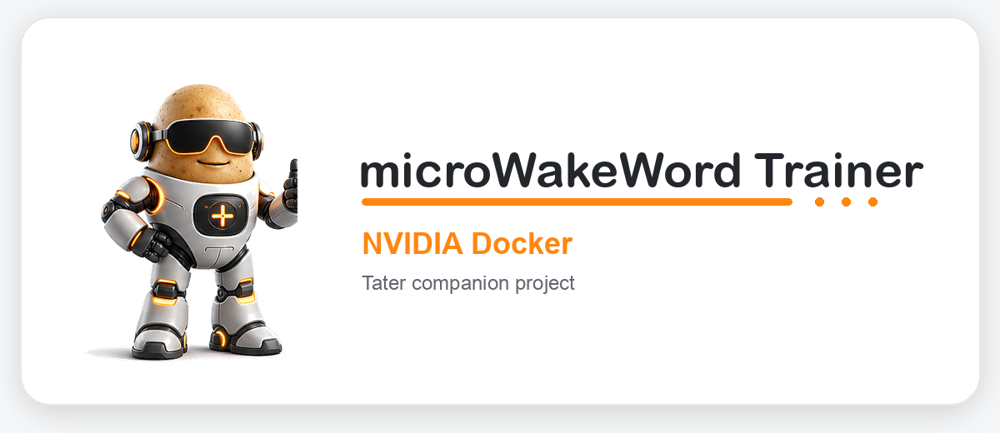

<div align="center">
  <a href="https://taterassistant.com">
    
  </a>
</div>
<h3 align="center">
  <a href="https://taterassistant.com">taterassistant.com</a>
</h3>

Train custom microWakeWord models in Docker with NVIDIA/CUDA acceleration, generated Piper samples, device-captured samples, reviewed false-wake negatives, live training logs, and local wake-word links for Tater Native satellites.

Real samples come from device-captured wake audio, close misses, or manual uploads. Every saved sample is normalized to `16 kHz / mono / 16-bit PCM WAV` before training.

---

## Docker Image

```bash
docker pull ghcr.io/tatertotterson/microwakeword:latest
```

Tagged releases also publish matching immutable image tags:

```bash
docker pull ghcr.io/tatertotterson/microwakeword:v15
```

The release tag must match `VERSION`. Update `WHATS_NEW.md` before tagging; the Docker workflow prepends it to GitHub's automatically generated release notes.

RTX 50-series / Blackwell GPUs use a separate image with CUDA 12.8 and a
Python 3.13 TensorFlow build for `sm_120`:

```bash
docker pull ghcr.io/tatertotterson/microwakeword:blackwell
docker pull ghcr.io/tatertotterson/microwakeword:v15-blackwell
```

Use the Blackwell image only for RTX 50-series cards. It includes the
community-built TensorFlow wheel from
[chivitiH/tensorflow-blackwell-python313](https://github.com/chivitiH/tensorflow-blackwell-python313),
which is unofficial and licensed CC BY-NC 4.0.

---

## Run The Container

```bash
docker run -d \
  --gpus all \
  --network host \
  -e REC_PORT=8789 \
  -v $(pwd):/data \
  ghcr.io/tatertotterson/microwakeword:latest
```

Use a version tag such as `ghcr.io/tatertotterson/microwakeword:v15` when you want to pin a known release instead of tracking `latest`.
For RTX 50-series cards, use `ghcr.io/tatertotterson/microwakeword:blackwell`
or a pinned tag such as `ghcr.io/tatertotterson/microwakeword:v15-blackwell`
in the same `docker run` command.

The flags:

- `--gpus all` enables GPU acceleration.
- `--network host` exposes the trainer server directly so satellites can send captured audio and load trained wake-word files.
- `-e REC_PORT=8789` sets the trainer web UI and captured-audio port. Change this value if `8789` is already in use.
- `-v $(pwd):/data` persists models, downloaded voices, datasets, samples, and generated wake-word artifacts.

If you do not use host networking, publish the trainer port and make sure satellites can reach it from your LAN.

Open:

```text
http://localhost:8789
```

If you change `REC_PORT`, open that port instead and use the same port in the satellite `Trainer App URL`.

---

## What The UI Does

- `Trainer` starts a wake-word session, shows positive/negative sample counts, and launches training.
- `Auto Training` transcribes real wake triggers, promotes phrase-misses to hard negatives, schedules retraining, and refreshes Tater Native satellites.
- `Captured Audio` reviews clips sent by Tater Native or ESPHome sats, including wake hits, close misses, and false wakes.
- `Samples` plays, removes, clears, and manually imports personal or negative samples.
- `Wake Words` lists locally trained JSON/model links for live wake-word switching in Tater.
- Popup consoles show colorized training logs while long-running jobs are active.

---

## Captured Audio Workflow

To collect samples from a sat, point its trainer feedback setting at this app. Tater Native satellites use the native settings popup in Tater. Older ESPHome satellites can still use their device entities.

For Tater Native satellites, enable trainer feedback in Tater:

- `Send Good Wakes To Trainer` toggles upload of confirmed wake-word triggers.
- `Send Close Misses To Trainer` toggles upload of near misses.
- `Trainer App URL` sets the trainer address, for example `http://trainer.local:8789` or `http://<trainer-ip>:8789`.

For older ESPHome firmware, the equivalent capture setup is exposed as device entities:

- `Capture Wake Audio` toggles upload of wake-word triggers.
- `Capture Close Misses` toggles upload of near misses.
- `Trainer App URL` sets the trainer address, for example `http://<trainer-ip>:8789`.

Satellites send raw captured audio to:

```text
/api/upload_captured_audio_raw
```

Keep the training app running and reachable at the `Trainer App URL` while capture is enabled. The sats upload clips live; if the app is stopped or the URL is wrong, captured audio will not be saved.

In the `Captured Audio` tab:

- play each clip from the inbox
- mark good wake-word clips as `This is good`
- mark bad triggers as `False wake`
- discard clips that should not be used

Approved clips move into:

```text
/data/personal_samples/
```

False wakes move into:

```text
/data/negative_samples/
```

Captured audio is boosted for easier playback in the UI, then kept in the correct training format.

---

## Samples

The `Samples` tab is the sample library.

- `Personal` samples are positive examples of the wake word.
- `Negative` samples are reviewed false wakes or hard negatives.
- Both can be played back and removed one at a time.
- Manual upload is available here as an optional seed path.

Accepted manual upload formats include:

- WAV
- MP3
- M4A
- FLAC
- OGG
- AAC
- OPUS
- WEBM

Uploads are validated or converted with `ffmpeg` into:

```text
16 kHz / mono / 16-bit PCM WAV
```

Starting a new session does not clear samples. Use the clear buttons in `Samples` if you want to remove saved personal or negative clips.

---

## Auto Training

`Auto Training` is an opt-in sample-review and retraining loop. It is disabled until you enter the exact wake phrase and enable it.

For each new wake-trigger clip sent to the trainer:

1. Faster Whisper transcribes the audio locally.
2. If the transcript contains the configured wake phrase, the clip stays in `Captured Audio` for manual review by default.
3. If speech was transcribed but the wake phrase is absent, the clip moves to `/data/negative_samples/` as an auto-reviewed hard negative.
4. Empty transcripts, VAD-blocked captures, and captures for another wake word stay out of the automatic negative path.

Two optional cleanup rules are available:

- `Delete confirmed good wakes` removes normal wake-trigger clips after STT confirms the configured phrase.
- `Promote confirmed close misses` checks close misses that passed VAD and moves them to the personal positive samples only when STT confirms the configured phrase.

A close miss with an empty transcript or without the configured phrase stays in `Captured Audio`; it is never turned into a negative automatically. Saving Auto Training settings also scans existing eligible captures. Enabling close-miss promotion reviews previous unreviewed close misses, while enabling cleanup removes previously confirmed good wakes without transcribing them a second time.

The default `small.en` model uses CUDA with `float16` when CTranslate2 can see an NVIDIA GPU, and falls back to CPU with `int8`. Choose a multilingual Faster Whisper model such as `small` when the wake phrase is not English. Downloaded STT models are cached in `/data/auto_train_models/`.

Scheduled training runs only after the configured number of new automatic negatives has accumulated. A successful run securely publishes the trained wake-word name and JSON URL to the linked Tater instance. Tater saves it as the global satellite wake word and pushes the updated setting to every connected satellite, so no satellite firmware change is required.

The `Trainer public URL` must be reachable from the satellites. With the documented `--network host` command, the trainer can normally use the LAN address from the browser request or host network. If you open the UI as `http://localhost:8789`, enter a value such as `http://192.168.1.50:8789`, or start the container with `REC_PUBLIC_BASE_URL` set to that value. When using Docker bridge networking, always set this URL to the published host address; a container bridge address is not satellite-reachable.

The default Tater URL, `http://127.0.0.1:8501`, assumes the documented host networking. Change it to a container-reachable Tater address if you use another Docker network. Click `Link Tater` and enter the short-lived code shown in Tater Voice Settings; the resulting trainer-specific link credential is stored in `/data/auto_train_config.json` with owner-only permissions.

---

## Training Flow

1. Enter the wake phrase in `Trainer`.
2. Choose the language.
3. Optionally test pronunciation with `Test TTS`.
4. Review the positive and negative sample counts.
5. Click `Start training`.
6. Watch the popup training console.

Personal samples are optional. Training can run with zero personal samples after confirmation, using generated TTS samples and the stock negative datasets.

Reviewed negative samples are converted into `/data/work/reviewed_negative_features/` and inserted into the training YAML as a hard-negative feature set when present.

On RTX 50-series / Blackwell GPUs, the Blackwell Docker image keeps sample generation and augmentation in the normal Python 3.12 trainer environment, then runs only the TensorFlow training/export stage in `/data/.venv-blackwell` with Python 3.13 and the Blackwell-native TensorFlow wheel.

---

## Language Support

The language picker is dynamic.

- `en` is always available.
- English keeps the existing dedicated generator model path.
- Non-English languages are discovered from the Piper voices catalog and any local Piper voice metadata.
- When a non-English language is selected, the trainer downloads all voices for that selected language only.
- Already-downloaded voices are reused.
- It does not download every language up front.

If the upstream Piper catalog is unavailable, already-installed local voices are used when available.

---

## Dataset Behavior

The first training run downloads and prepares missing training assets into `/data`, including:

- Piper voices for the selected language
- negative datasets and background data
- the Python training environment
- generated samples and augmented feature caches

After those assets are prepared, later runs reuse the local copies unless the mounted `/data` contents are deleted.

---

## Trained Wake Words

The `Wake Words` tab lists locally trained wake-word packages from `/data/trained_wake_words/`.

- Copy the JSON URL into the Tater Native satellite settings to switch wake words live.
- Links use the configured public trainer URL, a non-loopback browser host, or the detected LAN address instead of advertising `127.0.0.1` to satellites.
- Open the JSON or model links directly for quick inspection.
- The JSON includes the matching model path plus Tater tuning metadata.
- No firmware flashing happens from this trainer app anymore.

Use the main Tater app for satellite firmware updates and USB flashing.

---

## Output Files

Successful runs produce timestamped training output folders such as:

```text
/data/output/<timestamp>-<wake_word>-<samples>-<steps>/<wake_word>.tflite
/data/output/<timestamp>-<wake_word>-<samples>-<steps>/<wake_word>.json
```

The trainer also syncs Tater-ready wake-word artifacts into:

```text
/data/trained_wake_words/<wake_word>.tflite
/data/trained_wake_words/<wake_word>.json
```

The `Wake Words` tab uses `/data/trained_wake_words/` to populate the local wake-word links.

The JSON keeps the standard microWakeWord fields for compatibility:

```json
{
  "micro": {
    "probability_cutoff": 0.97,
    "sliding_window_size": 6
  }
}
```

It also includes Tater Native metadata used by newer satellites and the Tater settings UI:

```json
{
  "model_format": "tflite_stream_state_internal_quant",
  "quantization": "int8",
  "sample_rate": 16000,
  "tater_native": {
    "format_version": 1,
    "wake_threshold": 0.97,
    "wake_sliding_window": 6,
    "close_miss_threshold": 0.80,
    "frontend": {
      "name": "tflm_microfrontend",
      "sample_rate": 16000,
      "feature_duration_ms": 30,
      "feature_step_ms": 10,
      "feature_size": 40
    }
  }
}
```

Calibration metrics are included under `calibration` so false accepts/hour and recall can be surfaced in the UI.
Calibration evaluates thresholds from `0.95` through `1.00` with sliding windows of `5`, `6`, and `7`. Among candidates within 0.5 percentage points of the best recall, it prefers the lowest measured ambient false-accept rate. If calibration cannot complete, packaging uses the conservative `0.97` threshold and a window of `6`.

---

## Resetting Everything

If you want a clean slate, stop the container and remove the contents of the mounted `/data` directory.

That removes:

- personal samples
- negative samples
- captured inbox clips
- downloaded Piper voices
- cached datasets
- training environments
- trained models
- Auto Training settings, state, transcripts, and cached Faster Whisper models

---

## Important Notes

- Personal samples are optional.
- Negative samples are optional but useful for reducing false wakes.
- Auto Training is disabled by default and only classifies actual wake triggers automatically.
- The UI server is `trainer_server.py`.
- The launcher is `run.sh`.
- Trainer capture settings live in Tater for Tater Native satellites, and on device entities for older ESPHome satellites.

---

## Credits

Built on top of:

- [microWakeWord](https://github.com/kahrendt/microWakeWord)
- [piper-sample-generator](https://github.com/rhasspy/piper-sample-generator)
- [tensorflow-blackwell-python313](https://github.com/chivitiH/tensorflow-blackwell-python313) for the optional RTX 50-series / Blackwell image
